## MySQL explain语句用途
后端的日常开发中经常需要用到SQL查询语句。在执行一些数据量大，需要关联好几张表，而且需要各种order by、having查询条件的查询语句的时候，我们能够很明显地感觉到这些查询语句比一般的查询要慢很多。如果这个慢查询语句对应的是一个比较重要的查询接口，用户需要频繁地调用，那么查询响应速度较慢是一个对用户不能忍受的事情。这个时候，我们就需要对这些慢查询语句进行优化了。
优化查询语句最有效的途径就是知道这条慢查询语句的执行过程，并给涉及到的表添加适当的索引。而MySQL的explain语句就是一种非常实用的分析查询执行过程的工具。
(本次MySQL explain 介绍基于MySQL 8.0版本)
## explain 输出行
一条explain语句的执行，会输出一张包含id、select_type、table、partitions、type、possible_keys、key、key_len、ref、rows、filtered、Extra这几个字段的表格。

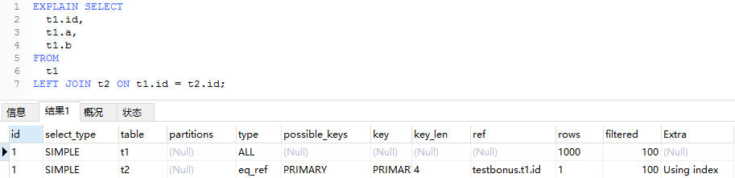
*explain例图*

| 列名          | 解释                               | 官方文档解释                                   |
| :------------ | :--------------------------------- | :--------------------------------------------- |
| id            | 查询id                             | The SELECT identifier                          |
| select_type   | 查询类型                           | The SELECT type                                |
| table         | 表名                               | The table for the output row                   |
| partitions    | 查询匹配的分区                     | The matching partitions                        |
| type          | 关联类型                           | The join type                                  |
| possible_keys | MySQL优化器可能选择的索引key       | The possible indexes to choose                 |
| key           | 实际执行查询时选择的索引key        | The index actually chosen                      |
| key_len       | 选择的索引的使用长度               | The length of the chosen key                   |
| ref           | join时对比的字段                   | The columns compared to the index              |
| rows          | 预估执行查询时扫描的行数           | Estimate of rows to be examined                |
| filtered      | 根据表查询条件过滤的扫描行数百分值 | Percentage of rows filtered by table condition |
| Extra         | 额外信息                           | Additional information                         |

---

- id
select查询语句的执行序列号。当explain表的某一行代表union的结果值时，id值为null。在这种情况下，这一行的table字段值会以类似<*union M,N*>的形式出现，来表名这个union的结果是id为M和N的查询语句的联合结果。

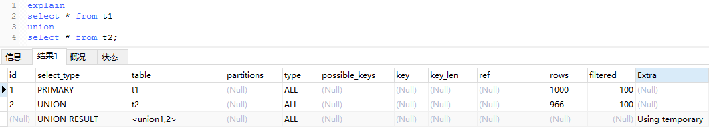
*union explain例图*

- select_type
查询语句的类型如下表所示：

|select_type|解释|官方文档解释|
|:-------------------|:------------------------------------------------------------------------------------------------|:--------------------------------------------------------------------------------------------------------|
|SIMPLE|简单查询(不使用union或者子查询)|Simple SELECT (not using UNION or subqueries)|
|PRIMARY|一个需要union操作或者含有子查询的select，位于最外层的单位查询的select_type即为primary。且只有一个|Outermost SELECT|
|UNION|union连接的select查询，除了第一个表外，第二个及以后的表select_type都是union|Second or later SELECT statement in a UNION|
|DEPENDENT UNION|与union一样，出现在union 或union all语句中，但是这个查询要受到外部查询的影响|Second or later SELECT statement in a UNION, dependent on outer query|
|UNION RESULT|union的结果集|Result of a UNION.|
|SUBQUERY|除了from字句中包含的子查询外，其他地方出现的子查询都可能是subquery|First SELECT in subquery|
|DEPENDENT SUBQUERY|与dependent union类似，表示这个subquery的查询要受到外部表查询的影响|First SELECT in subquery, dependent on outer query|
|DERIVED|from字句中出现的子查询|Derived table|
|DEPENDENT DERIVED|与derived类似，并且这个查询依赖其他的表|Derived table dependent on another table|
|MATERIALIZED|被物化的子查询|Materialized subquery|
|UNCACHEABLE SUBQUERY|对于外层的主表，子查询不可被物化，每次都需要计算（耗时操作）|A subquery for which the result cannot be cached and must be re-evaluated for each row of the outer query|
|UNCACHEABLE UNION|UNION操作中，内层的不可被物化的子查询（类似于UNCACHEABLE SUBQUERY）|The second or later select in a UNION that belongs to an uncacheable subquery (see UNCACHEABLE SUBQUERY)|

- table
显示的查询表名，如果查询使用了别名，那么这里显示的是别名。
它也可能是以下显示的值：
  - <*unionM,N*>: 这一行代表着id为M和N的查询的关联结果。
  - <*derivedN*>: 该派生表取值于id为N的的查询结果。例如，派生表可能来自于FROM子句的子查询。
  - <*subqueryN*>: 这一行来自于id为N的查询的物化子查询的查询结果

- partitions
该列显示的为分区表命中的分区情况。非分区表该字段为空（null）。

- type
查询语句的关联类型。

- possible_keys
possible_keys表示MySQL执行查询时可以选择的表的索引。

- key
key表示MySQL执行查询时实际上用到的索引。可能会出现key表示的索引并没有列在possible_key中的情况。这中情况可能是在possible_key中列出的索引都不适合用来查询，但是所有查询出来的列都包含在另外的一个索引中。也就是说，命名索引覆盖了所选列，因此虽然它不用于确定要检索的行，但索引扫描比数据行扫描更有效。

- key_len
key_len代表MySQL决定使用一个索引的长度。观察key_len可以让你知道MySQL实际上使用了一个联合索引的多少个字段。

- ref
ref的值代表被用来与key中的索引作对比的列或者常量。

- rows
这里是执行计划中估算的扫描行数，不是精确值。

- filtered
这个字段表示存储引擎返回的数据在server层过滤后，剩下多少满足查询的记录数量的比例，注意是百分比，不是具体记录数。

- Extra
这个字段显示了MySQL执行查询时的额外信息。

## explain 关联类型
explain中的type字段表示MySQL是如何来关联一张表的。关联类型执行效率由高到低分别为：system、const、eq_ref、ref、fulltext、ref_or_null、index_merge、unique_subquery、index_subquery、range、index、ALL。
为什么是这样的排序呢？

##### 不使用索引的执行过程
一般的关联查询执行过程为：
1.先从驱动表里面找出一条数据R
2.然后再去被驱动表里面作全表搜索
3.在被驱动表中与R相匹配的每一行数据都会与R组成一行结果行，并被放到结果集中
4.重复步骤1到3，直到驱动表的末尾循环结束

我们先创建两张有100行数据的表来测试：
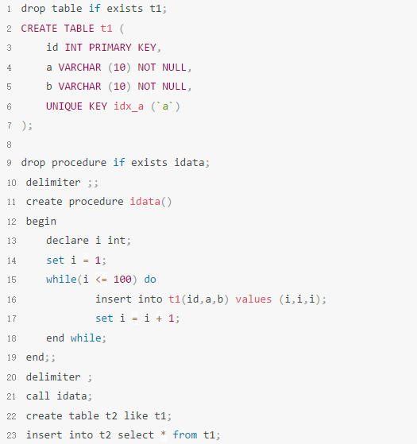

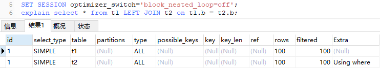

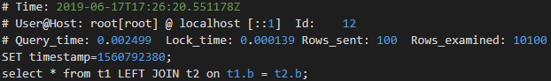

通过慢查询日志来看，这次的查询总共搜索了10100行数据，其执行流程是：
1.先从t1中拿出一条数据R
2.然后遍历一遍表t2
3.如果t2中的表有与R相匹配的数据，则把这条数据与R进行合并，然后放到结果集中
4.重复步骤1到3，直到驱动表的末尾循环结束。

所以查询的行数为：100 + 100 * 100 = 10100
执行时间为：0.002499

##### innodb b+树索引介绍
简单的关联查询，在语句执行的过程中，驱动表每一条数据都要与被驱动表的所有数据对比一遍。事实上只需要在被驱动表中找到与驱动表的数据相匹配的行就可以了，有没有办法可以快速找到能够作匹配的行呢？答案是有的。

在InnoDB中，表都是根据主键顺序以索引的形式存放的，这种存储方式的表称为索引组织表。InnoDB使用了B+树索引模型，所以数据都是存储在B+树的叶子节点上。

假设，我们有一个主键列为ID的表，表中有字段k，并且在k上有索引。

```
CREATE TABLE t (
    id INT PRIMARY KEY,
    k INT NOT NULL,
    tname VARCHAR (16),
    INDEX (k)
) ENGINE = INNODB;

insert into t(id,k,tname) values ('1','100','name1');
insert into t(id,k,tname) values ('2','200','name2');
insert into t(id,k,tname) values ('3','300','name3');
insert into t(id,k,tname) values ('4','400','name4');
insert into t(id,k,tname) values ('5','500','name5');
insert into t(id,k,tname) values ('6','600','name6');
```

下图为表t的两棵树的叶子节点示意图：
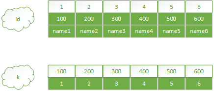

从图中不难看出，根据叶子节点的内容，索引类型分为主键索引和非主键索引。

主键索引的叶子节点存的是整行数据。在InnoDB里，主键索引也被称为聚簇索引（clustered index）。

非主键索引的叶子节点内容是主键的值。在InnoDB里，非主键索引也被称为二级索引（secondary index）。

根据上面的索引结构说明，我们来讨论一个问题：**基于主键索引和普通索引的查询有什么区别？**

- 如果语句是select * from t where id=5，即主键查询方式，则只需要搜索id这棵B+树；
- 如果语句是select * from t where k=500，即普通索引查询方式，则需要先搜索k索引树，得到id的值为5，再到id索引树搜索一次。这个过程称为**回表**。

也就是说，基于非主键索引的查询需要多扫描一棵索引树。因此，我们在应用中应该尽量使用主键查询。

##### 使用索引的执行过程
我们来看一下MySQL在使用索引的执行流程
使用索引的关联查询执行过程为：
1.先从驱动表里面找出一条数据R
2.然后根据R中的匹配值，到被驱动表的索引中找到相匹配的数据行
3.在被驱动表中与R相匹配的每一行数据都会与R组成一行结果行，并被放到结果集中
4.重复步骤1到3，直到驱动表的末尾循环结束

我们继续使用上文中创建的t1和t2两张表来测试：

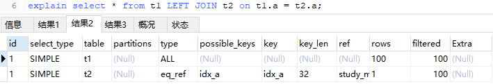

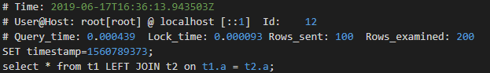

通过慢查询日志来看，这次的查询总共搜索了200行数据，其执行流程是：
1.先从t1中拿出一条数据R
2.然后使用t2的索引idx_a来查找与数据R相匹配的行数据
3.如果t2中的索引idx_a找到与R相匹配的数据，则把这条数据与R进行合并，然后放到结果集中
4.重复步骤1到3，直到驱动表的末尾循环结束。

所以查询的行数为：100 + 1 * 100 = 200
执行时间为：0.000439

通过ALL类型和eq_ref类型的执行对比，我们可以知道，**不同类型的执行会影响到MySQL查询表的行数**，从而影响查询的效率。

下面，我们按照由高到低的执行效率来介绍剩余的关联类型吧。

##### system
查询的表中只有一行数据，且这张表属于系统表。这是const的特殊类型。

一般来说，系统表的存储引擎用的是Memory。一般来说保存在内存里面的数据查询速度肯定是比存在硬盘里面的要快的。

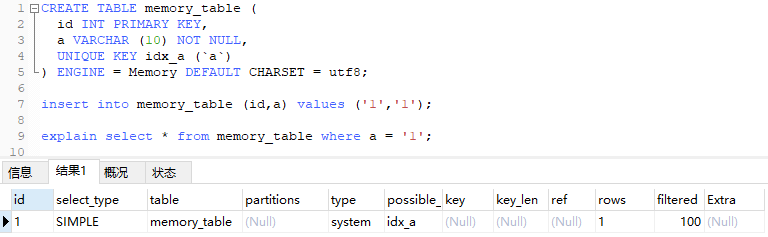

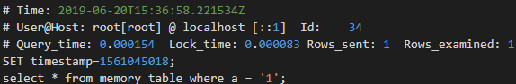

##### const
表中最多只有一行匹配行，在查询的开头读取。因为只有一行的数据，优化器可以把这一行的值看作常量。const表查询的速度非常的快，因为其只读一次。
当你使用主键或唯一键来作比较时，你可以使用const类型。

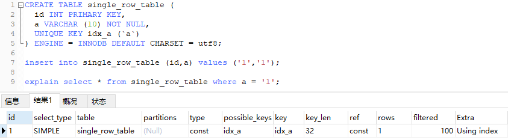

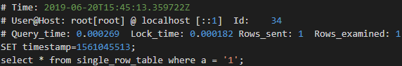

##### eq_ref
前一张表的每一行与这张表的数据相结合时，这张表都只读取一行数据。除了system和const外，eq_ref是最好的关联类型了。它在索引的每一部分都用作比较的时候用到，并且这些索引是主键或者非空唯一索引。
eq_ref关联类型可以在"="操作时用到，比较的值可以是常量或者是来自上一张表的行。


##### ref
前一张表的每一行与这张表的数据相结合时，这张表的每一个匹配行都可以从某个索引找得到。当关联时使用到了索引的最左前缀部分或者索引不是主键或者唯一索引时(换句话说，关联时不能找到单一的匹配行)可以使用ref关联类型。如果关联时索引可以匹配到一小部分的行数据时，ref是一个很好的选择。
ref可以在"="和"<=>"操作时用到。

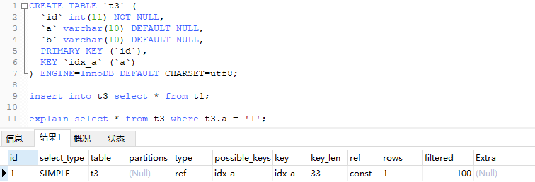

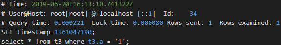

##### fulltext
关联时用到了*FULLTEXT*索引

##### ref_or_null
这个关联类型与ref类似，不过它在搜索null值时作了额外的操作。ref_or_null常用于解析子查询。在以下示例中，MySQL可以使用ref_or_null连接来处理ref_table：
```
SELECT * FROM ref_table
  WHERE key_column=expr OR key_column IS NULL;
```

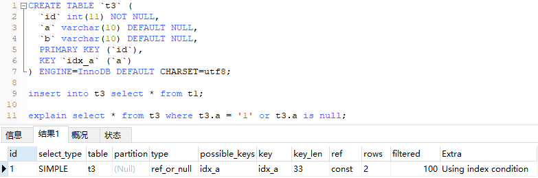

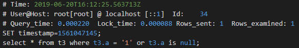

##### index_merge
index_merge代表MySQL使用了Index Merge优化。在这种关联中，key这一列会显示MySQL使用到的索引列表，key_len这一列会显示每个索引使用到的最大长度的列表。

##### unique_subquery
这个关联类型在一些IN子查询中代替eq_ref，如：
```
value IN (SELECT primary_key FROM single_table WHERE some_expr)
```

unique_subquery是一个可以完全代替子查询的索引查找函数，以获取更好的查询效率

##### index_subquery
index_subquery和unique_subquery类似。它也可以用来代替IN子查询，但是它在非唯一索引的IN子查询中使用：
```
value IN (SELECT key_column FROM single_table WHERE some_expr)
```
##### range
使用索引在给出的范围内检索匹配的行。key列显示的值表示使用的索引是什么。key_len包含了索引使用的行的长度。ref列在这种关联类型中显示为null。
range关联类型可以在 =, <>, >, >=, <, <=, IS NULL, <=>, BETWEEN, LIKE, or IN()等操作符中使用。
```
SELECT * FROM tbl_name
  WHERE key_column = 10;

SELECT * FROM tbl_name
  WHERE key_column BETWEEN 10 and 20;

SELECT * FROM tbl_name
  WHERE key_column IN (10,20,30);

SELECT * FROM tbl_name
  WHERE key_part1 = 10 AND key_part2 IN (10,20,30);
```

##### index
index关联类型与ALL相似，不过index检索的是索引树.index关联会在以下两种情况中出现：
  - 查询中使用了索引覆盖，并且在索引中有能够满足查询结果的行，那么这个时候MySQL就只会遍历索引，不会执行全表扫描。在这种情况下Extra列会显示Using index。索引扫描的效率一般情况下会比全表扫描效率要高，因为索引的占用空间比全表要小。
  - 全表扫描时需要根据索引的顺序来查找行。这种情况下Extra列不会出现Using index。

##### ALL
表关联时使用了全表扫描。一般情况下来说ALL是一种非常糟糕的关联方式。很多时候你都可以通过合理地添加索引来避免ALL关联。

## explain Extra
explain中的Extra列中显示了MySQL执行查询时的额外信息。下面将介绍Extra字段中常见的值。
如果你想要使你的查询尽可能的快，那就去看一下Extra列中是有没有Using filesort和Using temporary。

##### Distinct
MySQL使用某个值来作区分进行查找，当它找到第一个匹配的行时，MySQL就会停止对之后的匹配行的查找。

##### Using filesort
MySQL必须用一个额外的传输来确定怎么按照排列顺序来检索行。排序需要根据关联类型遍历所有的行，然后存储这些排序所用到的key，并且指向所有符合where子句的行。这些被存储起来的key会被排序，然后被检索出来。

##### Using index
查询的行信息只从索引树中获取，没有做额外的回表操作。这种查询策略可以在查询语句只使用到单一索引的某部分时使用。

##### Using join buffer (Block Nested Loop)
执行关联时前面的表会把一部分数据放进join buffer，这些在join buffer中的行数据会被用来与当前表的数据进行关联。一般的关联查询，如果没有索引可用，MySQL会自动把查询优化成BNL(Block Nested Loop)查询


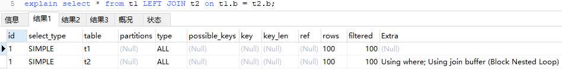

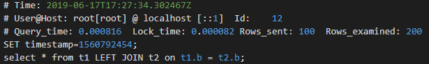

查询的执行流程：

1. 把表t1的数据读入线程内存join_buffer中，由于我们这个语句中写的是select *，因此是把整个表t1放入了内存；
2. 扫描表t2，把表t2中的每一行取出来，跟join_buffer中的数据做对比，满足join条件的，作为结果集的一部分返回。

这个过程相当于对表t1和t2都做了一次全表扫描，由于join_buffer是以无序数组的方式组织的，因此对表t2中的每一行，都要做100次判断，总共需要在内存中做的判断次数是：100*100=10000次。

##### Using temporary
执行查询时，MySQL需要用到临时表来保存结果。查询中包含group by和order by时经常会使用临时表。

例子：
```
CREATE TABLE `t1` (
  `id` int(11) NOT NULL,
  `a` varchar(10) NOT NULL,
  `b` varchar(10) DEFAULT NULL,
  PRIMARY KEY (`id`),
  KEY `idx_a` (`a`)
) ENGINE=InnoDB DEFAULT CHARSET=utf8;

insert into t1 values ('1','1','1');
insert into t1 values ('2','2','2');
···
insert into t1 values ('100','100','100');

explain select id%10 m, count(*) c from t1 group by m;
```

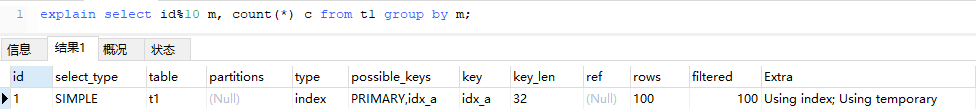

这个语句的执行流程是这样的：

1. 创建内存临时表，表里有两个字段m和c，主键是m；
2. 扫描表t1的索引a，依次取出叶子节点上的id值，计算id%10的结果，记为x；
   1. 如果临时表中没有主键为x的行，就插入一个记录(x,1);
   2. 如果表中有主键为x的行，就将x这一行的c值加1；
3. 得到结果集返回给客户端。

##### Using where
查询时使用了where子句来限制与下一张表作关联或者输出到客户端的行。

##### Using index condition
查询表数据时先查询该表的索引信息，来决定是否需要回表查这一行的数据。

## 常见的优化例子
##### 明明建了索引，为什么explain时发现没有使用索引
假设你现在维护了一个交易系统，其中交易记录表tradelog包含交易流水号（tradeid）、交易员id（operator）、交易时间（t_modified）等字段。系统里还有另外一个表trade_detail，用于记录交易的操作细节。为了便于量化分析和复现，我往交易日志表tradelog和交易详情表trade_detail这两个表里插入一些数据。
```
CREATE TABLE `trade_detail` (
  `id` int(11) NOT NULL,
  `tradeid` varchar(32) DEFAULT NULL,
  `trade_step` int(11) DEFAULT NULL,
  `step_info` varchar(32) DEFAULT NULL,
  PRIMARY KEY (`id`),
  KEY `tradeid` (`tradeid`)
) ENGINE=InnoDB DEFAULT CHARSET=utf8;

CREATE TABLE `tradelog` (
  `id` int(11) NOT NULL,
  `tradeid` varchar(32) DEFAULT NULL,
  `operator` int(11) DEFAULT NULL,
  `t_modified` datetime DEFAULT NULL,
  PRIMARY KEY (`id`),
  KEY `tradeid` (`tradeid`),
  KEY `t_modified` (`t_modified`)
) ENGINE=InnoDB DEFAULT CHARSET=utf8mb4 COLLATE=utf8mb4;

insert into tradelog values(1, 'aaaaaaaa', 1000, now());
insert into tradelog values(2, 'aaaaaaab', 1000, now());
insert into tradelog values(3, 'aaaaaaac', 1000, now());

insert into trade_detail values(1, 'aaaaaaaa', 1, 'add');
insert into trade_detail values(2, 'aaaaaaaa', 2, 'update');
insert into trade_detail values(3, 'aaaaaaaa', 3, 'commit');
insert into trade_detail values(4, 'aaaaaaab', 1, 'add');
insert into trade_detail values(5, 'aaaaaaab', 2, 'update');
insert into trade_detail values(6, 'aaaaaaab', 3, 'update again');
insert into trade_detail values(7, 'aaaaaaab', 4, 'commit');
insert into trade_detail values(8, 'aaaaaaac', 1, 'add');
insert into trade_detail values(9, 'aaaaaaac', 2, 'update');
insert into trade_detail values(10, 'aaaaaaac', 3, 'update again');
insert into trade_detail values(11, 'aaaaaaac', 4, 'commit');
```

这时候，如果要查询id=2的交易的所有操作步骤信息，SQL语句可以这么写：
```
select d.* from tradelog l, trade_detail d where d.tradeid=l.tradeid and l.id=2;
```
理论上来说，tradelog和trade_detail两张表都有相同的索引tradeid，在关联查询的时候是会使用到索引的，但是事实上却并非如此：

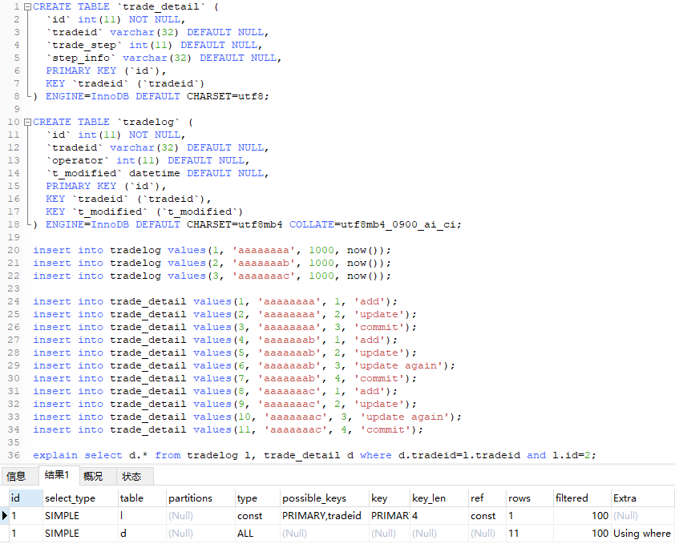

为什么会这样呢？

因为**对索引字段做函数操作，可能会破坏索引值的有序性，因此优化器就决定放弃走树搜索功能**。

我们来通过show warnings语句来查看一下这条语句被优化器优化后的执行语句：

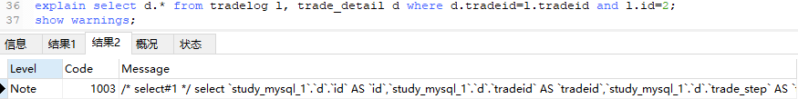
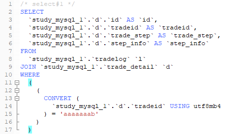

trade_detail的字符集为utf-8，而tradelog字符集为utf8mb4，实际上，tradeid关联的操作为：
```
CONVERT (`study_mysql_1`.`d`.`tradeid` USING utf8mb4) = 'aaaaaaab'
```

为了使关联的两个字段字符集一样，我们修改一下trade_detail表的tradeid字段
```
alter table trade_detail modify tradeid varchar(32) CHARACTER SET utf8mb4 default null;
```
修改表字段字符集后的explain结果：

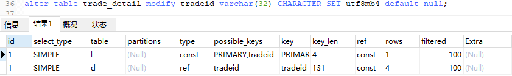

##### 字段的类型和长度要一致，MySQL才能使用索引

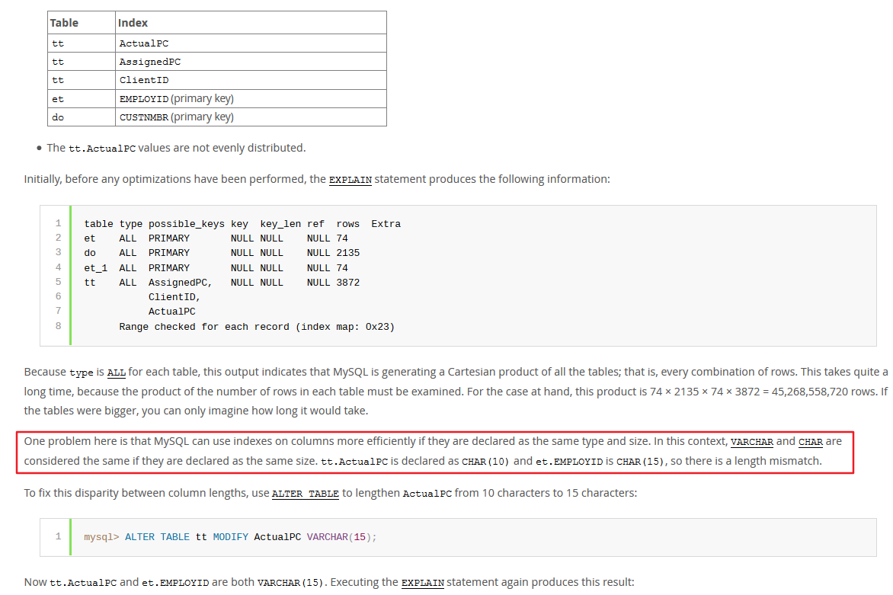

详情请看官方文档：[EXPLAIN Output Interpretation](https://dev.mysql.com/doc/refman/8.0/en/explain-output.html#explain-output-interpretation)

##### 排序优化
假设有一张表t，t包含了市民的一些基本信息。
```
CREATE TABLE `t` (
  `id` int(11) NOT NULL,
  `city` varchar(16) NOT NULL,
  `name` varchar(16) NOT NULL,
  `age` int(11) NOT NULL,
  `addr` varchar(128) DEFAULT NULL,
  PRIMARY KEY (`id`)
) ENGINE=InnoDB;

insert into t (id,city,`name`,age,addr) values ('1','c1','n1','21','addr1');
insert into t (id,city,`name`,age,addr) values ('2','c2','n2','22','addr2');
insert into t (id,city,`name`,age,addr) values ('3','c3','n3','23','addr3');
······
insert into t (id,city,`name`,age,addr) values ('n','cn','nn','23','addrn');
```
现在我们要查询c3市的市民信息，并且要按照市民名称来排列显示：

```
select city,name,age from t where city='c3' order by name;
```
explain结果：
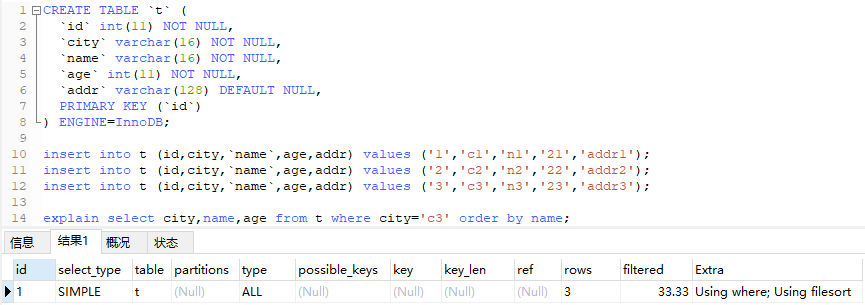

一般情况下，我们可以给city加索引，来筛选需要显示的结果：
```
alter table t add key idx_city (`city`);
```
添加idx_city索引后的explain结果：
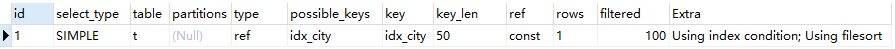

###### **排序过程**
MySQL会给每个线程分配一块内存用于排序，称为*sort_buffer*。

通常情况下，这个语句执行流程如下所示 ：

1. 初始化sort_buffer，确定放入name、city、age这三个字段；

2. 从索引city找到第一个满足city='c3'条件的主键id；

3. 到主键id索引取出整行，取name、city、age三个字段的值，存入sort_buffer中；

4. 从索引city取下一个记录的主键id；

5. 重复步骤3、4直到city的值不满足查询条件为止；

6. 对sort_buffer中的数据按照字段name做快速排序；


但是**对于带order by子句的查询来说，更好的优化是直接使用索引查询来避免不必要的排序操作**：
```
alter table t add key idx_city_name (`city`,`name`);
```
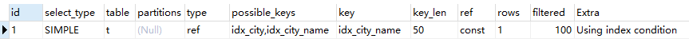

添加idx_city_name索引后的的查询流程：
直接找到所有city='c3'的主键，然后回表找到各个id对应行的name、city、age三个字段的值，最后返回结果

其优化的原理：
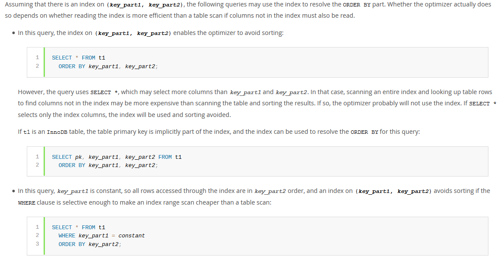

有关order by的优化可以查看官方文档：[ORDER BY Optimization](https://dev.mysql.com/doc/refman/8.0/en/order-by-optimization.html)

## 总结
1. 看explain的输出行时，一般看type和key来大概了解SQL语句的执行过程
2. 关联类型执行效率由高到低分别为：system、const、eq_ref、ref、fulltext、ref_or_null、index_merge、unique_subquery、index_subquery、range、index、ALL。经量使用执行效率更高的关联类型。
3. 在InnoDB中，表都是根据主键顺序以索引的形式存放的。而普通索引都是按照键值的大小有序存放的。
4. 主键索引的叶子节点存的是整行数据。非主键索引的叶子节点内容是主键的值。
5. 在平时自己写SQL的时候，心里估算一下一条SQL语句查询的行数，然后再通过慢查询日志来与自己的估算结果作对比，对自己了解MySQL的执行过程很有帮助。
6. explain中的Extra列中显示了MySQL执行查询时的额外信息。在explain语句后面紧跟一条show warnings语句可以看到MySQL优化器优化查询语句的结果。
7. 对索引字段做函数操作，可能会破坏索引值的有序性。如果发现两张关联的表都添加了索引，但是MySQL执行查询的时候并没有走索引，那么你可以找一下在做索引字段关联的时候是不是对索引字段做了函数操作。例如两个字段的字符集是否一致。
8. 字段的类型和长度要一致，MySQL才能使用索引
9. 当查询语句有使用order by子句的时候，可以尝试一下使用索引来避免浪费系统资源的排序操作。

## 分享一些个人的经验
很多技术上面的细节，都是要在自己动手实践之后才会知道的，学到的知识点如果能够动手写一些demo的话，不仅能对知识了解得更深，而且还能得到很多意外的收获。其实写这个explain课程的时候，我想做到每一个讲到的知识点都让人能够让人信服，这就需要花一些时间去准备一些例子。在这个过程中，自己也遇到过很多需要突破技术盲区的地方，例如我想要看到一条语句到底查询了多少行，这个时候我就需要知道怎么开启慢查询日志。我想让别人知道Simple Nested-Loop Join，那么我就必须关闭BNL(Block Nested-Loop Join)，那么我就需要找到MySQL的优化器选项，然后去关闭BNL优化。

官方文档是宝库！如果在优化SQL语句的过程中发现有什么问题的话，除了找百度，Google，Stack Overflow之外，还可以去看下官方文档。

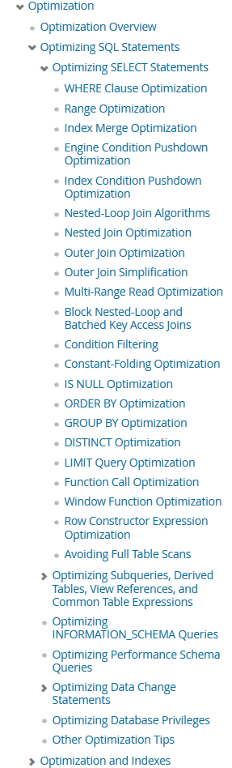