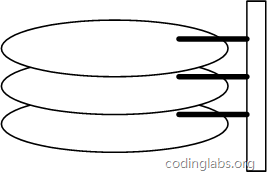

### 操作系统读取数据原理
一切程序的逻辑到最后都是要由计算机硬件进行操作的。我们先来看一下主存和磁盘的存取原理。
#### 主存存取原理
目前计算机使用的主存基本都是随机读写存储器（RAM），现代RAM的结构和存取原理比较复杂，这里本文抛却具体差别，抽象出一个十分简单的存取模型来说明RAM的工作原理。图中展示了一个4 x 4的主存模型。


从抽象角度看，主存是一系列的*存储单元*组成的矩阵，每个*存储单元*存储固定大小的数据。每个*存储单元*有唯一的地址，现代主存的编址规则比较复杂，这里将其简化成一个二维地址：通过一个行地址和一个列地址可以唯一定位到一个*存储单元*。

主存的存取过程如下：

当系统需要读取主存时，则将*地址信号*放到地址总线上传给主存，主存读到*地址信号*后，解析信号并定位到指定*存储单元*，然后将此*存储单元*数据放到数据总线上，供其它部件读取。

写主存的过程类似，系统将要写入单元地址和数据分别放在地址总线和数据总线上，主存读取两个总线的内容，做相应的写操作。

这里可以看出，主存存取的时间仅与存取次数呈线性关系，因为不存在机械操作，两次存取的数据的“距离”不会对时间有任何影响，例如，先取A0再取A1和先取A0再取D3的时间消耗是一样的。

#### 磁盘存取原理
与主存不同，磁盘I/O存在机械运动耗费，因此磁盘I/O的时间消耗是巨大的。


*磁盘的整体结构示意图*

一个磁盘由大小相同且同轴的圆形盘片组成，磁盘可以转动（各个磁盘必须同步转动）。在磁盘的一侧有磁头支架，磁头支架固定了一组磁头，每个磁头负责存取一个磁盘的内容。磁头不能转动，但是可以沿磁盘半径方向运动（实际是斜切向运动），每个磁头同一时刻也必须是同轴的，即从正上方向下看，所有磁头任何时候都是重叠的（不过目前已经有多磁头独立技术，可不受此限制）。


*磁盘结构的示意图*

盘片被划分成一系列同心环，圆心是盘片中心，每个同心环叫做一个磁道，所有半径相同的磁道组成一个柱面。磁道被沿半径线划分成一个个小的段，每个段叫做一个扇区，每个扇区是磁盘的最小存储单元。为了简单起见，我们下面假设磁盘只有一个盘片和一个磁头。

当需要从磁盘读取数据时，系统会将数据逻辑地址传给磁盘，磁盘的控制电路按照寻址逻辑将逻辑地址翻译成物理地址，即确定要读的数据在哪个磁道，哪个扇区。为了读取这个扇区的数据，需要将磁头放到这个扇区上方，为了实现这一点，磁头需要移动对准相应磁道，这个过程叫做寻道，所耗费时间叫做*寻道时间*，然后磁盘旋转将目标扇区旋转到磁头下，这个过程耗费的时间叫做*旋转时间*。

##### 局部性原理与磁盘预读
由于存储介质的特性，磁盘本身存取就比主存慢很多，再加上机械运动耗费，磁盘的存取速度往往是主存的几百分分之一。即使现在被广为使用的固态硬盘，其读取速度跟内存相比，还是有一定的差距。因此为了提高效率，要尽量减少磁盘I/O。为了达到这个目的，磁盘往往不是严格按需读取，而是每次都会预读，即使只需要一个字节，磁盘也会从这个位置开始，顺序向后读取一定长度的数据放入内存。这样做的理论依据是计算机科学中著名的局部性原理：

```
当一个数据被用到时，其附近的数据也通常会马上被使用。

程序运行期间所需要的数据通常比较集中。
```

由于磁盘顺序读取的效率很高（不需要寻道时间，只需很少的旋转时间），因此对于具有局部性的程序来说，预读可以提高I/O效率。

预读的长度一般为页（page）的整倍数。页是计算机管理存储器的逻辑块，硬件及操作系统往往将主存和磁盘存储区分割为连续的大小相等的块，每个存储块称为一页（在许多操作系统中，页的大小通常为4k），主存和磁盘以页为单位交换数据。当程序要读取的数据不在主存中时，会触发一个缺页异常，此时系统会向磁盘发出读盘信号，磁盘会找到数据的起始位置并向后连续读取一页或几页载入内存中，然后异常返回，程序继续运行。

### B树与B+树
#### B树介绍
为了描述B-Tree，首先定义一条数据记录为一个二元组[key, data]，key为记录的键值，对于不同数据记录，key是互不相同的；data为数据记录除key外的数据。那么B-Tree是满足下列条件的数据结构：

- d为大于1的一个正整数，称为B-Tree的度。
- h为一个正整数，称为B-Tree的高度。
- 每个非叶子节点由n-1个key和n个指针组成，其中d<=n<=2d。
- 每个叶子节点最少包含一个key和两个指针，最多包含2d-1个key和2d个指针，叶节点的指针均为null。
- 所有叶节点具有相同的深度，等于树高h。
- key和指针互相间隔，节点两端是指针。
- 一个节点中的key从左到右非递减排列。
- 所有节点组成树结构。
- 每个指针要么为null，要么指向另外一个节点。
- 如果某个指针在节点node最左边且不为null，则其指向节点的所有key小于v(key1)，其中v(key1)为node的第一个key的值。
- 如果某个指针在节点node最右边且不为null，则其指向节点的所有key大于v(keym)，其中v(keym)为node的最后一个key的值。
- 如果某个指针在节点node的左右相邻key分别是keyi和keyi+1且不为null，则其指向节点的所有key小于v(keyi+1)且大于v(keyi)。


图中是一个d=2的B-Tree示意图

由于B-Tree的特性，在B-Tree中按key检索数据的算法非常直观：首先从根节点进行二分查找，如果找到则返回对应节点的data，否则对相应区间的指针指向的节点递归进行查找，直到找到节点或找到null指针，前者查找成功，后者查找失败。B-Tree上查找算法的伪代码如下：

```
    BTree_Search(node, key) {
        if(node == null) return null;
        foreach(node.key)
        {
            if(node.key[i] == key) return node.data[i];
                if(node.key[i] > key) return BTree_Search(point[i]->node);
        }
        return BTree_Search(point[i+1]->node);
    }
    data = BTree_Search(root, my_key);
```

关于B-Tree有一系列有趣的性质，例如一个度为d的B-Tree，设其索引N个key，则其树高h的上限为log_d((N+1)/2)，检索一个key，其查找节点个数的渐进复杂度为O(log_dN)。从这点可以看出，B-Tree是一个非常有效率的索引数据结构。

另外，由于插入删除新的数据记录会破坏B-Tree的性质，因此在插入删除时，需要对树进行一个分裂、合并、转移等操作以保持B-Tree性质，本文不打算完整讨论B-Tree这些内容，因为已经有许多资料详细说明了B-Tree的数学性质及插入删除算法，有兴趣的朋友可以找相应的资料进行阅读。

#### B+树介绍
与B-Tree相比，B+Tree内节点不存储data，只存储key；叶子节点不存储指针。


*一个简单的B+Tree示意图*

由于并不是所有节点都具有相同的域，因此B+Tree中叶节点和内节点一般大小不同。这点与B-Tree不同，虽然B-Tree中不同节点存放的key和指针可能数量不一致，但是每个节点的域和上限是一致的，所以在实现中B-Tree往往对每个节点申请同等大小的空间。

一般在数据库系统或文件系统中使用的B+Tree结构都在经典B+Tree的基础上进行了优化，增加了顺序访问指针。


*带有顺序访问指针的B+Tree*

如图所示，在B+Tree的每个叶子节点增加一个指向相邻叶子节点的指针，就形成了带有顺序访问指针的B+Tree。做这个优化的目的是为了提高区间访问的性能，例如图中如果要查询key为从18到49的所有数据记录，当找到18后，只需顺着节点和指针顺序遍历就可以一次性访问到所有数据节点，极大提到了区间查询效率。

#### 为什么B+树比较适合当数据库的索引
通过操作系统读取数据原理的介绍，我们知道数据库在读取数据的时候，越少的磁盘IO意味着越高效的读取速度(磁盘的存取速度跟内存的存取速度相比实在是差太多了，至少现在如此，科技实在是太落后了)。

先从B-Tree分析，根据B-Tree的定义，可知检索一次最多需要访问h个节点。数据库系统的设计者巧妙利用了磁盘预读原理，将一个节点的大小设为等于一个页，这样每个节点只需要一次I/O就可以完全载入。为了达到这个目的，在实际实现B-Tree还需要使用如下技巧：

- 每次新建节点时，直接申请一个页的空间，这样就保证一个节点物理上也存储在一个页里，加之计算机存储分配都是按页对齐的，就实现了一个node只需一次I/O。
- B-Tree中一次检索最多需要h-1次I/O（根节点常驻内存），渐进复杂度为O(h)=O(log_dN)。一般实际应用中，出度d是非常大的数字，通常超过100，因此h非常小（通常不超过3）。

综上所述，用B-Tree作为索引结构效率是非常高的。

而像红黑树这种平衡二叉搜索树结构，h明显要深的多。由于逻辑上很近的节点（父子）物理上可能很远，无法利用局部性，所以红黑树的I/O渐进复杂度也为O(h)，效率明显比B-Tree差很多。

B+Tree更适合外存索引，原因和内节点出度d有关。从上面分析可以看到，d越大索引的性能越好，而出度的上限取决于节点内key和data的大小：
```
d_{max}=floor(pagesize / (keysize + datasize + pointsize))
```
floor表示向下取整。由于B+Tree内节点去掉了data域，因此可以拥有更大的出度，拥有更好的性能。

### 参考文献
[MySQL索引背后的数据结构及算法原理](https://blog.codinglabs.org/articles/theory-of-mysql-index.html "MySQL索引背后的数据结构及算法原理")
